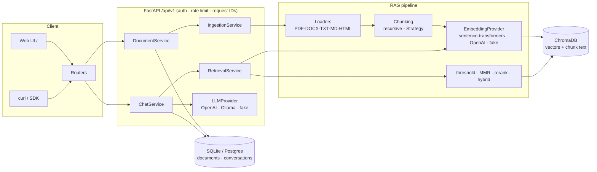

# Intelligent Enterprise Document Assistant

[](https://github.com/m3alrashdan/enterprise-doc-assistant/actions/workflows/ci.yml)


Enterprise question answering over internal documents using
**Retrieval-Augmented Generation (RAG)**. Employees upload documents
(PDF, DOCX, TXT, MD, HTML) and ask natural-language questions; the assistant
answers **only from document content** with inline citations
(`[1]`, `[2]` → document, page/section, snippet). If the answer isn't in the
documents, it says so instead of hallucinating.

Built with FastAPI (async) · LangChain · ChromaDB · sentence-transformers ·
pluggable LLMs (OpenAI / local Llama via Ollama) · SQLAlchemy · Docker.

## Features

- **Document ingestion pipeline** — multi-file upload with validation
  (type, size, SHA-256 dedup), async background processing with
  `pending → processing → ready | failed` status tracking, per-format loaders
  that extract page numbers and section headings into chunk metadata
- **Retrieval** — top-k semantic search with a similarity threshold,
  **MMR** for diversity, metadata filtering (document IDs, tags), optional
  **cross-encoder reranking** and **hybrid BM25 + vector search** (config flags)
- **Grounded generation** — numbered context sources, answer-only-from-context
  prompt, `[n]` citation markers resolved back to source chunks, refusal
  sentinel when the corpus has no answer
- **Streaming** — Server-Sent Events endpoint (`sources → token* → done`)
- **Conversation memory** — history persisted per `conversation_id`; follow-up
  questions are condensed into standalone queries before retrieval
- **API quality** — versioned under `/api/v1`, X-API-Key auth (JWT stub
  documented), rate limiting, consistent error envelope, request-ID structured
  JSON logging, liveness + readiness probes, full OpenAPI docs
- **Ops** — multi-stage non-root Dockerfile, docker-compose (app + ChromaDB +
  optional Ollama), GitHub Actions CI, ≥80% test coverage enforced
- **Extras** — evaluation script (retrieval hit-rate + faithfulness), minimal
  web UI for upload + chat at `/`

## Architecture



Every provider (LLM, embeddings, vector store, chunker) sits behind a
Protocol interface and is chosen by configuration — swapping OpenAI for a
local Llama, or fake providers for tests, requires **zero code changes**.
See [docs/architecture.md](docs/architecture.md) for design decisions.

## Quickstart

### Local (with the demo Ollama setup)

```bash
# 1. install (creates .venv, CPU-only torch)
make install

# 2. configure
cp .env.example .env        # defaults: Ollama LLM + local bge-small embeddings
# have an Ollama model available:  ollama pull llama3.1
#   (then set OLLAMA_MODEL=llama3.1 in .env)
# or use OpenAI instead:           LLM_PROVIDER=openai, OPENAI_API_KEY=sk-...

# 3. run
make run                    # http://localhost:8000  (docs at /docs, UI at /)

# 4. ingest the bundled sample documents
make ingest-sample
```

### Docker

```bash
docker compose up --build -d          # app + ChromaDB server
# optional local LLM inside compose:
docker compose --profile ollama up -d
docker compose exec ollama ollama pull llama3.1
```

## API walkthrough (curl)

```bash
KEY="dev-secret-key"   # matches API_KEYS in .env

# health
curl -s localhost:8000/health/ready | jq

# upload documents (multi-file, async ingestion)
curl -s -X POST localhost:8000/api/v1/documents/upload \
  -H "X-API-Key: $KEY" \
  -F "files=@sample_data/employee_handbook.pdf" \
  -F "tag=hr" | jq

# poll status until "ready"
curl -s localhost:8000/api/v1/documents -H "X-API-Key: $KEY" | jq '.items[] | {filename, status, chunk_count}'

# ask a question -> cited answer
curl -s -X POST localhost:8000/api/v1/chat/query \
  -H "X-API-Key: $KEY" -H "Content-Type: application/json" \
  -d '{"question": "How many vacation days do employees get per year?"}' | jq

# follow-up in the same conversation (uses conversation_id from the response)
curl -s -X POST localhost:8000/api/v1/chat/query \
  -H "X-API-Key: $KEY" -H "Content-Type: application/json" \
  -d '{"question": "And how many can be carried over?", "conversation_id": "<id>"}' | jq .answer

# stream the answer (SSE: sources -> token* -> done)
curl -sN -X POST localhost:8000/api/v1/chat/stream \
  -H "X-API-Key: $KEY" -H "Content-Type: application/json" \
  -d '{"question": "What is the expense policy for meals?"}'

# delete a document (removes vectors + metadata + file)
curl -s -X DELETE localhost:8000/api/v1/documents/<id> -H "X-API-Key: $KEY" -i
```

Example `/chat/query` response:

```json
{
  "answer": "Full-time employees accrue 20 paid vacation days per calendar year [1].",
  "citations": [
    {
      "index": 1,
      "document_id": "1f2a3b...",
      "document_name": "employee_handbook.pdf",
      "page": 2,
      "section": null,
      "snippet": "Full-time employees accrue 20 paid vacation days...",
      "score": 0.83
    }
  ],
  "conversation_id": "b71c9d2e",
  "latency_ms": 912.4,
  "model_used": "ollama:llama3.1"
}
```

## Configuration

Everything is set via environment / `.env` (see `.env.example` for the full
annotated list). Key variables:

| Variable | Default | Description |
|---|---|---|
| `LLM_PROVIDER` | `ollama` | `openai` \| `ollama` \| `fake` |
| `OPENAI_MODEL` / `OLLAMA_MODEL` | `gpt-4o-mini` / `llama3.1` | model per provider |
| `EMBEDDING_PROVIDER` | `sentence_transformers` | `sentence_transformers` \| `openai` \| `fake` |
| `EMBEDDING_MODEL` | `BAAI/bge-small-en-v1.5` | any sentence-transformers model |
| `CHUNK_SIZE` / `CHUNK_OVERLAP` | `1000` / `200` | characters |
| `TOP_K` / `FETCH_K` | `4` / `20` | chunks for the LLM / MMR candidate pool |
| `SIMILARITY_THRESHOLD` | `0.25` | cosine floor; weaker matches dropped |
| `USE_MMR` / `MMR_LAMBDA` | `true` / `0.5` | diversity re-ranking |
| `RERANK_ENABLED` | `false` | cross-encoder rerank of the shortlist |
| `HYBRID_SEARCH_ENABLED` / `HYBRID_ALPHA` | `false` / `0.5` | BM25 + vector fusion |
| `API_KEYS` | – | comma-separated keys; empty disables auth (dev) |
| `RATE_LIMIT` | `60/minute` | per API key (fallback: client IP) |
| `CHROMA_MODE` | `embedded` | `embedded` \| `http` (compose uses `http`) |
| `DATABASE_URL` | sqlite | any async SQLAlchemy URL (Postgres ready) |

## Testing & evaluation

```bash
make test          # 100+ tests, fully offline (fake providers, temp stores)
make coverage      # coverage report (CI enforces >= 80%)
make lint          # ruff + black
.venv/bin/python scripts/evaluate.py   # retrieval hit-rate + faithfulness
```

## Project structure

```
app/
├── api/            # routers (v1), middleware, error envelope, health
├── core/           # settings, logging, security, exceptions, DI container
├── services/       # ingestion, documents, retrieval, chat, rerank, hybrid
├── rag/
│   ├── loaders/    # PDF, DOCX, TXT, MD, HTML -> elements with page/section
│   ├── chunking/   # Strategy-pattern chunkers (recursive)
│   ├── embeddings/ # sentence-transformers / OpenAI / fake
│   ├── vectorstore/# ChromaDB repository (embedded + http)
│   ├── llm/        # OpenAI / Ollama / fake providers
│   └── pipeline.py # prompts, context numbering, citation assembly
├── models/         # domain models (documents, chunks, citations)
├── db/             # SQLAlchemy models, session, repositories
└── main.py         # app factory
scripts/            # ingest_samples, evaluate, generate_sample_pdf
sample_data/        # demo documents + eval set
static/             # single-page demo UI
tests/              # unit / integration / api (offline)
```
