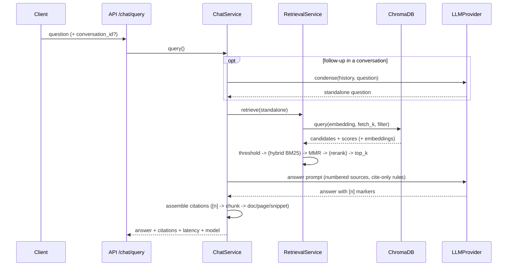

# Architecture & Design Decisions

## Layered architecture

```
routers (app/api)  ->  services (app/services)  ->  providers (app/rag, app/db)
```

- **Routers** validate requests, call one service method, shape the response.
  No business logic lives in a router.
- **Services** own the business logic (ingestion, retrieval, chat
  orchestration, document lifecycle). They depend only on Protocol
  interfaces, never on concrete providers.
- **Providers** implement those Protocols: `LLMProvider`, `EmbeddingProvider`,
  `VectorStore`, `ChunkingStrategy`, `DocumentLoader`. Each has a factory
  driven purely by `Settings`, so implementations are swapped via `.env`
  (including `fake` implementations that make the whole test suite run
  offline with zero API keys).
- **The DI container** (`app/core/container.py`) wires everything once at
  startup inside the FastAPI lifespan and hangs off `app.state`. Request
  handlers get it via a `Depends`; tests build a container from their own
  settings. No globals, no import-time side effects.

## RAG pipeline flow



**Ingestion**: upload → validate (type/size/SHA-256 dedup) → store file +
`pending` record → background task: load (page/section metadata) → chunk →
embed in batches → ChromaDB with rich metadata → `ready`/`failed` status.

## Design decisions & trade-offs

### Why ChromaDB
Zero-ops persistent local mode for development plus a proper client/server
mode for compose/production, native metadata filtering, and cosine-space HNSW.
The wrapper (`app/rag/vectorstore/chroma.py`) exposes only the small
`VectorStore` Protocol, so moving to pgvector/Qdrant/Weaviate is a one-file
change. Distances are converted to similarities at the boundary so the rest of
the codebase never reasons about "lower is better".

### Chunking choices
Recursive character splitting (LangChain splitter) with size 1000 / overlap
200 by default. Two deliberate choices:

1. **Loaders emit coarse elements** (a PDF page, a heading-delimited section)
   and the chunker splits *within* an element. Page/section metadata is
   therefore always correct on every chunk — critical for citations.
2. **Strategy pattern**: `build_chunker()` is the single registration point;
   a semantic chunker (embedding-similarity boundaries) can be added without
   touching ingestion.

### Citation mechanism
Retrieved chunks are injected as numbered sources (`[1] (document, page,
section)`), and the prompt requires inline `[n]` markers. After generation the
markers are parsed and resolved back to their chunks — so a citation is always
a real retrieved chunk, never a model-invented reference. Guard rails:
out-of-range markers are dropped; a "not found" answer carries no citations;
an answer with no markers falls back to citing all retrieved chunks so
provenance is never silently lost. This is more robust than asking the model
for structured citation JSON (which weaker local models frequently mangle).

### Hallucination control
The prompt pins answers to the provided context and defines an exact refusal
sentence. When retrieval returns nothing above the similarity threshold, the
service short-circuits to the refusal answer without calling the LLM at all —
the cheapest and most reliable "I don't know".

### Retrieval quality ladder
Baseline top-k cosine → similarity threshold (drops weak matches) → optional
BM25+vector fusion (`HYBRID_SEARCH_ENABLED`, exact-keyword recall e.g. error
codes) → MMR (`USE_MMR`, de-duplicates near-identical chunks) → optional
cross-encoder rerank (`RERANK_ENABLED`, precision on the shortlist). Each rung
is independently toggleable, so quality/latency can be tuned per deployment.
Hybrid fusion re-scores the semantic candidates rather than merging BM25-only
candidates — keeps embeddings available for MMR; documented limitation.

### Conversation memory
History is persisted per `conversation_id` (survives restarts, horizontally
safe). Follow-ups are rewritten into standalone questions by the LLM before
retrieval ("what about carry-over?" → "how many vacation days can be carried
over?"), which keeps vector search meaningful for pronouns and ellipses.

### Async model
FastAPI is async end-to-end; CPU-bound provider work (sentence-transformers,
Chroma calls) runs in worker threads via `anyio.to_thread` so the event loop
never blocks. Ingestion uses FastAPI `BackgroundTasks` — deliberately simple;
the service method takes only a document ID, so promoting it to a real queue
(ARQ/Celery) later is trivial.

### Other trade-offs, stated honestly
- **Rate limiting** is an in-process fixed window keyed by API key. Correct
  per replica; use a shared store (Redis) behind the same middleware for
  fleet-wide limits.
- **Schema management** is `create_all` on startup — right-sized for a
  single-service metadata store; introduce Alembic when the schema evolves.
- **Auth** is static API keys behind one dependency (`require_api_key`);
  the JWT/OAuth2 upgrade path is stubbed in `app/core/security.py`.
- **BM25 index** is rebuilt per query from the (filtered) corpus — fine for
  internal-documents scale, swap for a persistent index at large scale.

## Testing strategy

- **Unit**: chunking, loaders (real files generated in-test), citation
  assembly, MMR math, providers, rate-limit parsing.
- **Integration**: full ingest→retrieve flow against a real temporary
  ChromaDB with deterministic fake embeddings (hashed bag-of-words — similar
  texts genuinely rank first, so retrieval assertions are meaningful).
- **API**: httpx `AsyncClient` against the ASGI app — upload lifecycle, chat
  with citations, SSE stream parsing, auth failures, rate limiting,
  validation errors.
- Everything runs offline with no API keys; CI enforces ≥80% coverage on
  `app/services` + `app/rag`.
